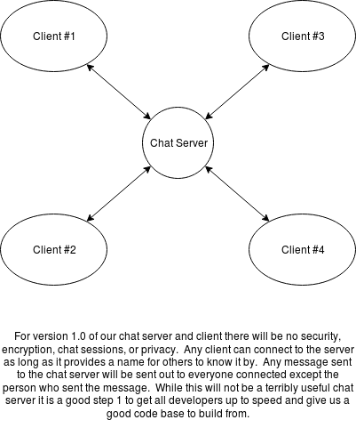

Python Gang Chat Server Project Management Plan
===============================================

The Python Gang is a group of Python programmers who got together on Facebook in order to work together to create projects to further each of our programming capabilities and help us to learn to work together as a team and work professionally as we would for a real business.

We decided our first project should be a chat server since it does not need to be overly complex at first and might eventually evolve into something worthwile.  This folder contains the Project Management documents for the Chat Server Project of the PythonGang.

Quick Overview
--------------

The Chat Server will be built in stages.  The first stage (Version 1.0) will be little more than a one-to-many echo server.  Any number of user clients can connect to the chat server with no security or encryption and the only requirement being that they give themselves a name so others know who said what.

